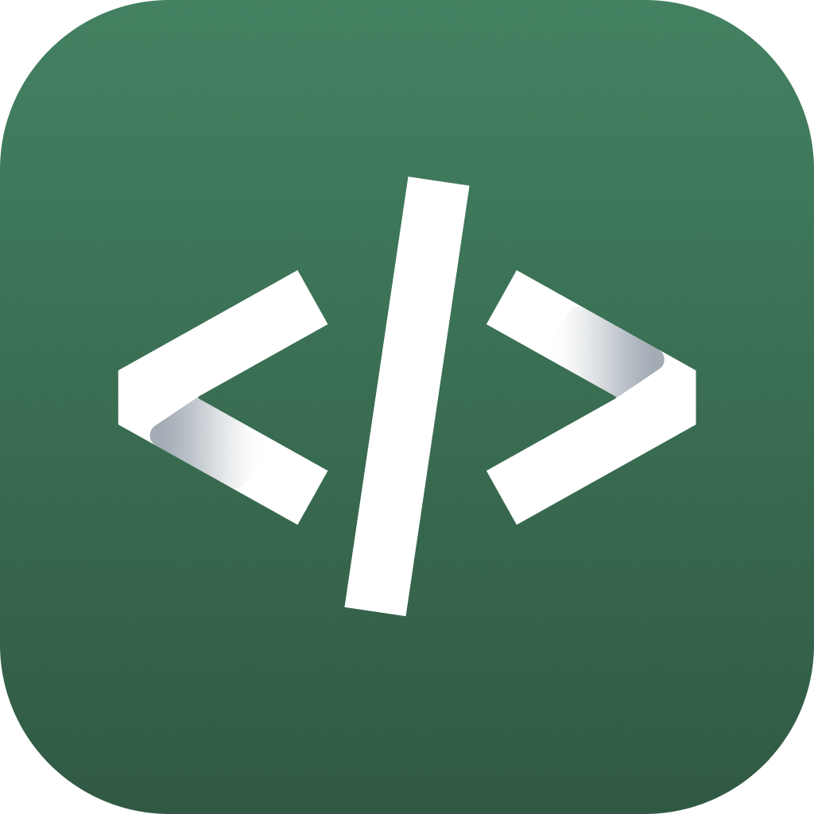

# Sema4.ai VSCode Extension SDK

Sema4.ai SDK: Visual Studio Code Extension for AI Agent, Actions and Automation Tasks development

👉 [Go here for more information!](./sema4ai/README.md)

# Development

👉 [Go here for more information!](./docs/develop.md)

# Release

👉 [Go here for more information!](./docs/release.md)

# Issue Reporting

**⁉️ PLEASE RETEST ISSUES YOU’VE ENCOUNTERED. PLEASE REPORT THEM AGAIN IF NEEDED.**

Please report issues as soon as you see them using the `Submit Issue` behind `Command Palette`.

Follow the message on [#dev-tools-bugs -channel](https://sema4ai.slack.com/archives/C0107FK9JR2) to give more details & get responses to your problem.
