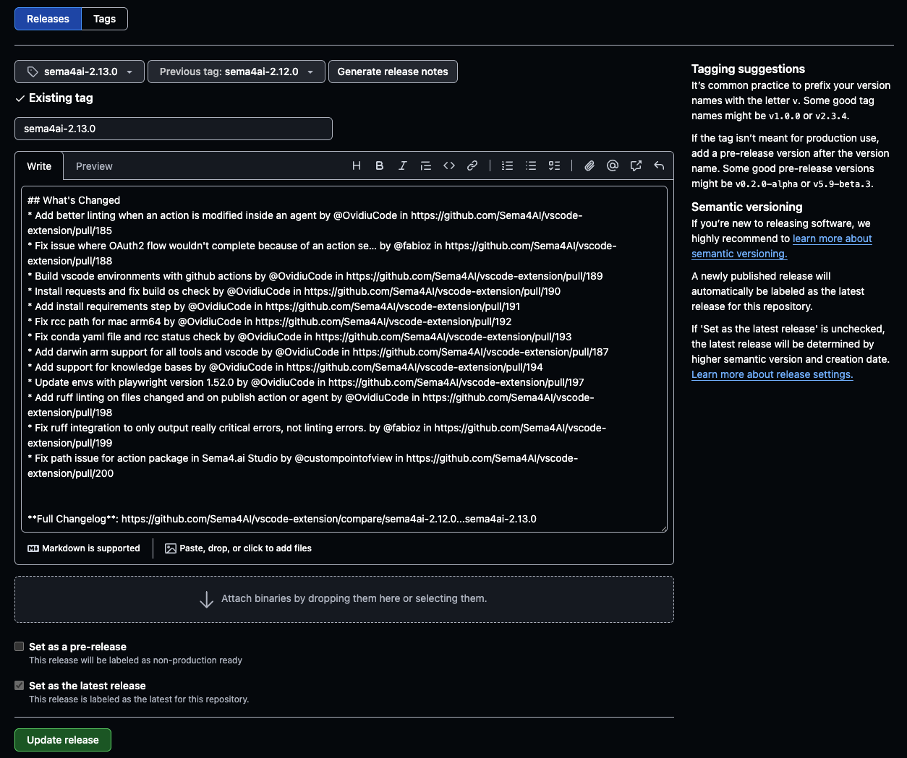

## Pre-Release

To release a new **pre-release** version:

1. Go to [VSCode Extensions Marketplace - Sema4.ai SDK](https://marketplace.visualstudio.com/items?itemName=sema4ai.sema4ai) and get the latest version number.
   1. Copy the latest version from there & increment only the patch version, this will be the version you use in the next step.
2. Run the [Pre-release - Sema4.ai Extension](https://github.com/Sema4AI/vscode-extension/actions/workflows/pre-release-robocorp-code.yml) workflow with the bugfix version bumped.
   1. 
   2. **Note:** It is important not to bump the major nor minor version.
   3. **Note:** Make sure all changes in the pre-release are under the _Unreleased_ section of the `/docs/changelog.md`
3. No other actions required.

## Release

Stable releases usually bump the minor version. The patch version number is usually reserved for pre-releases.

To release a **STABLE** new version:

- Open a shell at the proper place (something as `X:\sema4ai\vscode-extension\sema4ai`)
- Checkout the `master` branch and create a new branch from it (`release/2.12.0`)
- Update version using `python -m dev set-version 2.12.0`
- Update README.md to add notes on features/fixes
- Update `/docs/changelog.md`:
  - Add a new section for the new version (including the release date)
  - Move all items from the _Unreleased_ section to the new section
- Commit your changes using the following message: `Release Sema4.ai VSCode extension 2.12.0`
- Create PR
- After PR is merged to `master`, create a New Release from [Github Releases](https://github.com/Sema4AI/vscode-extension/releases)
- **Make sure you follow the same tagging pattern that was used beforehand - tags should be of value: `sema4ai-2.12.0`**
  
