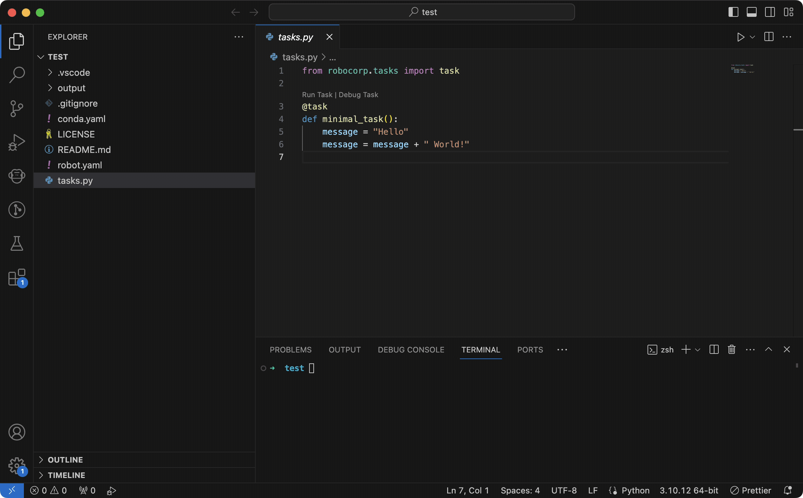

## Robocorp VS Code extension

The Robocorp extension makes it easy to create Python or Robot Framework based automation projects and software robots.

You can use this extension as part of the [Robocorp Automation Stack](https://github.com/robocorp/rcc), which has been optimized for tasks such as robotic process automation (RPA), web scraping and IT automation. It scales up from simple image fetching or API calling all the way to complex process automation workflows.

Main features include:

- **Automatic configuration of dependencies**, including Python and Robot Framework. Every project uses its own lightweight virtual environment and runs in isolation.

- **Automatic configuration of language server** for syntax highlighting and code completion in Robot Framework.

- **Create, run and debug projects**.

- **Deploy projects to Robocorp Cloud**.

Note: the use of cloud-based orchestration in [Robocorp Cloud](https://robocorp.com/robocorp-cloud) requires a free account.

### Get Started

1. Install this extension together with the [Robot Framework Language Server extension](https://marketplace.visualstudio.com/items?itemName=robocorp.robotframework-lsp).

1. Download [Robocorp VS Code extension - basic tutorial](https://robocorp.com/robots/robot/robocorp-vs-code-extension-basic-tutorial), and open it in VS Code.

1. Open the command palette - (Windows, Linux): `ctrl-shift-P` (macOS): `cmd-shift-P`

1. select the command `Robocorp: Run Robot`

1. Select the task to run (only if the robot contains more than one task).

More examples are available at https://robocorp.com/robots/.

You can also find a video tutorial on the [YouTube Robocorp channel](https://youtu.be/zQQl8xZkGko?list=PLfXJKwwF049DIZxvwYuBgahHcDDGPpfN6). 

Full instructions are available at [https://robocorp.com/docs/product-manuals/robocorp-code](https://robocorp.com/docs/product-manuals/robocorp-code).

### Features

- Create robots based on templates.

- Run Robots in virtual environments.

- Run Robots locally with VSCode run configuration.

- Debug Robots

- Deploy robots to Robocorp Cloud

We are actively developing the extension, [contact us](#Reporting-Issues) for issues and feature requests.

### Requirements

Supported operating systems: Windows 10, Linux or Mac OS.

The [Robot Framework Language Server](https://marketplace.visualstudio.com/items?itemName=robocorp.robotframework-lsp) extension provides extra Robot Framework related capabilities, including code completion and formatting, as well as syntax validation and highlighting. It is highly recommended to install it alongside this Robocorp Code extension.

### Installation

Find the full installation instructions at [https://robocorp.com/docs/product-manuals/robocorp-code](https://robocorp.com/docs/product-manuals/robocorp-code).

### Configuration

During the first activation, the extension will download additional dependencies (such as Conda manager) that are required for it to run.

### Features (0.8.0)

- Automatic bootstrapping of the Python environment for the `Robot Framework Language Server`.
- Create a Robot from a pre-configured template using the `Robocorp: Create Robot` action.
- Upload a Robot to the cloud with the `Robocorp: Upload Robot to the Robocorp Cloud` action.
- Link to the cloud with the `Robocorp: Link to Robocorp Cloud` action.
- Unlink from the cloud with the `Robocorp: Unlink and remove credentials from Robocorp Cloud` action.
- Run a Robot with the `Robocorp: Run Robot` action.
- Debug a Robot with the `Robocorp: Debug Robot` action. - It's possible to debug plain Python tasks using the Python extension or Robot Framework tasks using the Robot Framework Language Server (in which case the task must start with `python -m robot` and finish with the folder/filename to be run).
- When a [robot.yaml](https://robocorp.com/docs/setup/robot-yaml-format) is found, it utilises the related Python environment when running/debugging `.robot` files using the RobotFramework Language Server.
- Set the pythonPath configuration to get code completion in the Python extension through the `Set pythonPath based on robot.yaml` action.
- View, launch and debug Robots from the `Robots` view.
- View and create new [Browser Locators](https://robocorp.com/docs/development-howtos/browser/how-to-find-user-interface-elements-using-locators-in-web-applications) from the `Locators` view.
- View and create new [Image Locators](https://robocorp.com/docs/product-manuals/robocorp-lab/locating-and-targeting-user-interface-elements-in-robocorp-lab) from the `Locators` view.
- When hovering over a `"screenshot"`, `"path"` or `"source"` element in the `locators.json`, a preview is shown.
- Send issue reports with the `Robocorp: Submit issue` action.

### Developing

See: [Developing](docs/develop.md) for details on how to develop the `Robocorp Code` extension.

### Reporting Issues

Issues may be reported at: [https://github.com/robocorp/robotframework-lsp/issues/new/choose](https://github.com/robocorp/robotframework-lsp/issues/new/choose).

Forum: https://forum.robocorp.com/

Slack: robocorp-developers.slack.com

License: Apache 2.0
---
