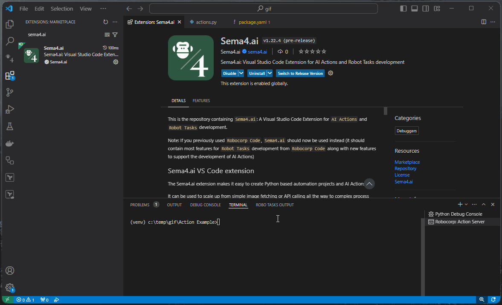
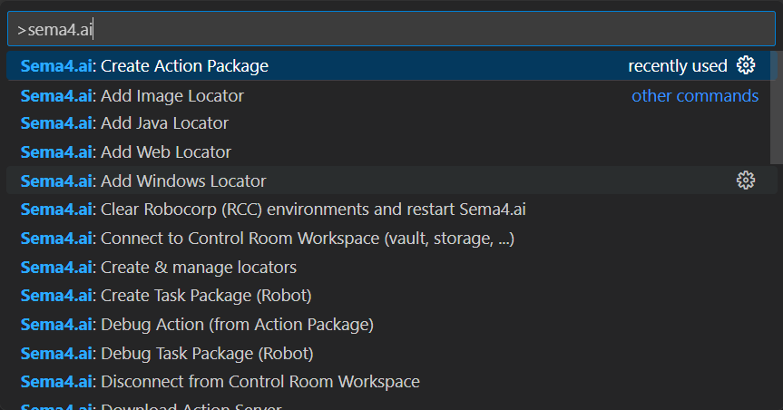

## Sema4.ai VS Code extension

> Note: The `Sema4.ai` extension fro VS Code will replace the [Robocorp Code](https://marketplace.visualstudio.com/items?itemName=robocorp.robocorp-code) -extension. The same features exist in this extension, so you can just switch to using `Sema4.ai`. Future development will be focused here.

The Sema4.ai extension makes it easy to create Python based automation projects and AI Actions.

It can be used to scale up from simple image fetching or API calling all the way to complex process enterprise automation workflows.

Main features include:

-   **Create, run and debug AI Actions** - Sema4.ai AI Actions provides end-to-end stack supporting every type of connection between AI and your apps and data. You are in control where to run the code and everything is built for easiness, security, and scalability. 

-   **Automatic configuration of dependencies** - Every Python oriented project uses its own lightweight virtual environment and runs in isolation.

-   **Inspector for Web, Windows Application Elements & more** - Pick elements from different mediums and create locators for automation

-   **Create, run and debug projects** - Do these with ease while developing Tasks to automate applications

-   **Deploy projects to Control Room** - Run unattended automation in a safe, reliable and easy to use Cloud Platform.

> Note: the use of cloud-based orchestration in [Control Room](https://cloud.robocorp.com/) requires a free account.

### Get Started

1. Download [Sema4.ai extension for VS Code](https://marketplace.visualstudio.com/items?itemName=sema4ai.sema4ai), and open it in VS Code.

2. Open the command palette - (Windows, Linux): `CTRL-SHIFT-P` (macOS): `CMD-SHIFT-P`

3. Select the command `Sema4.ai: Create Action Package`

4. Open the sidebar and start running you actions. You can also start the Action Server from the sidebar.

Full instructions are available at our [documentation site](https://sema4.ai/docs/platform/vs-code) for the VS Code Extension.

This is under active development, so please [contact us](https://sema4.ai/contact-us/) for issues and feature requests.

### Requirements

Supported operating systems: Windows, Linux or Mac OS.

### Configuration

During the first activation, the extension will download additional dependencies that are required for it to run.

### Features (1.22.3)

-   Rebranded `Robocorp Code` to `Sema4.ai`, keep the features, release as a new extension so that existing users have time to switch over.

### Developing

See: [Developing](../docs/develop.md) for details on how to develop the `Sema4.ai` -extension.

### Reporting Issues

Issues may be reported in the [GitHub Issues](https://github.com/Sema4AI/vscode-extension/issues/new/choose).

Contact us via Slack: [sema4ai-users.slack.com](https://sema4ai-users.slack.com/ssb/redirect)

## License: Apache 2.0
